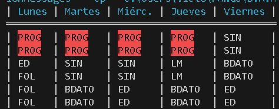

## EJERCICIO 4

Escribe un programa que muestre tu horario de clase. Puedes usar espacios o tabuladores para alinear el texto.

Añadele colores a las letras de los dís y fondos de colores a las asignaturas

